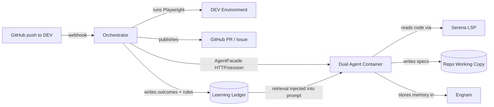

# panchito
<div align="center">

[](https://nodejs.org)
[](https://www.typescriptlang.org)
[](https://playwright.dev)
[](https://www.docker.com)
[](https://opencode.ai)

</div>

## Contents

- [1. Overview](#1-overview)
- [2. How it works](#2-how-it-works)
  - [Architecture](#architecture)
  - [The QA pipeline](#the-qa-pipeline)
  - [What happens at the end](#what-happens-at-the-end)
  - [The learning layer](#the-learning-layer)
- [3. Getting started](#3-getting-started)
  - [Prerequisites](#prerequisites)
  - [Install and verify](#install-and-verify)
  - [Configure your API key](#configure-your-api-key)
  - [AI model configuration](#ai-model-configuration)
  - [Onboard an app](#onboard-an-app)
  - [Trigger a manual run](#trigger-a-manual-run)
  - [Deploy with Docker](#deploy-with-docker)

---

**Autonomous QA that watches your repos, tests every deploy, and learns from every failure.**

When a commit lands on DEV, an AI agent reads the change, writes Playwright tests for what could break, runs them against the live environment, and either opens a PR against the app's repository with the new tests or files a GitHub Issue if something fails.

It is app-agnostic: onboard any repo by adding a single YAML file. No app code lives here.

---

## 1. Overview

panchito turns every deploy into a QA checkpoint, automatically.

| Capability | What it means |
|---|---|
| **Commit-aware testing** | Reads the diff and commit message to understand what changed. Skips style-only commits, writes targeted tests for features and fixes, runs regression-only for refactors. |
| **Provider-agnostic runtime** | Runs on OpenCode, Codex, or dual mode through one facade. Primary, reviewer, and chat models are configurable from the CLI or Dashboard. |
| **Two-model review** | A different AI model reviews every generated test for value. Tests that click without asserting, use fragile selectors, or miss the actual change are rejected before they reach the suite. |
| **Self-improving suite** | When tests pass and the reviewer approves, they are committed to the app's repository via PR with auto-merge. The suite grows with every deploy and never degrades into "green noise." |
| **Learning from failures** | Every failed run is reflected on, distilled into a reusable rule, and injected into future runs. Mutation testing measures whether the tests actually catch bugs (valueScore). Rules that correlate with better outcomes are promoted; the rest decay. |
| **Multi-app, single engine** | One centralized service watches all your team's repos. Each app gets its own namespace for test data and persistent memory. |
| **Shadow mode** | Onboard a repo without touching it: the full pipeline runs, but PRs and Issues are only logged. Flip the switch when you are ready. |

<details>
<summary>What it is not</summary>

- It does **not** build or start your app. Tests run against the live DEV URL.
- It does **not** replace your existing test suite. It augments it with AI-generated E2E coverage.
- It does **not** require per-app code changes. Onboarding is a YAML config file.

</details>

---

## 2. How it works

### Architecture



<table>
<tr>
<td width="50%" valign="top">

### Orchestrator
**Node.js** deterministic infrastructure.

Receives webhooks, manages the sequential queue, clones repos, runs Playwright against DEV, publishes results. Runs mutation testing to measure test quality (valueScore). Maintains the learning ledger: labels errors, reflects on failures, distills rules, and injects learned knowledge into future runs. Every side-effecting step is dependency-injected and unit-tested with stubs.

</td>
<td width="50%" valign="top">

### Agent Runtime
**OpenCode, Codex, or dual mode** behind one provider-neutral facade.

The primary agent reads code via Serena (semantic LSP navigation) and writes Playwright specs. The reviewer independently judges quality. Engram provides persistent episodic memory across runs. `panchito agent` or the Dashboard's Agent Runtime screen selects provider, role assignments, models, and API keys.

</td>
</tr>
</table>

Both services share a volume for repo working copies. The AI agent reads code and writes tests directly where the orchestrator expects them.

### The QA pipeline

Every run follows the same sequence, whether triggered by a webhook or manually:

| Step | What happens |
|---|---|
| **1. Deploy gate** | Waits until DEV reports the right commit SHA and is healthy. Skipped if no health endpoint is configured, or in code mode. |
| **2. Classification** | Reads the commit message and diff. Conventional Commits like `style:` with no logic changes are skipped before spending a single token. |
| **3. Retrieval** | Loads learned rules, structural patterns, and proven scenario archetypes from past runs — injects them into the agent prompt. |
| **4. Generation** | The AI agent reads the blast radius of the change using semantic code navigation, writes tests into the repo, and invokes the reviewer. |
| **5. Static gate** | TypeScript compilation, ESLint, and Playwright's test list must pass. Invalid code is rejected before execution. |
| **6. Execution** | Runs tests against the live DEV URL (e2e) or the repo's own test runner (code mode). Results are classified as pass, fail, or flaky. |
| **7. Oracle** | For code mode green runs: mutation testing via Stryker measures how many injected bugs the tests actually catch (valueScore). |
| **8. Reflection** | On failed runs, an LLM reflects on the error and produces a preventive rule. The rule is distilled and stored for future runs. |
| **9. Decision** | Green and approved: PR with auto-merge. Failures: GitHub Issue. Flaky: quarantined. DEV down: infrastructure error. |

> [!NOTE]
> **Shadow mode** (`qa.shadow: true` in the app config) runs the full pipeline but does not publish PRs or open Issues. Use this when onboarding a repo for the first time.

### What happens at the end

| Outcome | Action |
|---|---|
| All green, reviewer approved | PR with auto-merge commits tests into the app's repository |
| All green, reviewer rejected | GitHub Issue for the team to iterate |
| Failures detected | GitHub Issue with sanitized logs |
| Flaky tests | Quarantined, no Issue created |
| DEV unhealthy | Marked as infrastructure error, not a code bug |

### The learning layer

Beyond deciding pass/fail, panchito learns from every run to improve future ones:

| Component | What it does |
|---|---|
| **Labeler** | Classifies every run into an error class (E-STATIC, E-EXEC-FAIL, E-FALSE-POSITIVE…) — zero LLM, purely from the gates and reviewer. |
| **Oracle** | Measures test quality objectively. For code repos: mutation testing via Stryker — mutates source code, runs the test suite, and scores how many mutants were killed. |
| **Reflector** | On failed runs, an LLM analyzes the error and produces a structured reflection anchored to real artifacts (assert output, uncovered lines, reviewer corrections). |
| **Distiller** | Converts reflections into reusable rules — deduplicated, stored, and injected into future agent prompts so the same mistake isn't made twice. |
| **Curriculum** | Tracks which scenario archetypes (invalid input, re-query-after-mutation, empty state, …) have caught real bugs. Only proven archetypes are fed to the agent. |
| **Attribution** | When a rule was retrieved for a run, the run's valueScore updates the rule's successRate. Rules that correlate with good outcomes are promoted. |

Inspect the learning state at any time:

```bash
npm run qa -- --app my-app --learning
```

Or ask the TUI chat: *"¿qué reglas ha aprendido el sistema?"*

<details>
<summary>Execution modes</summary>

| Mode | When to use |
|---|---|
| `diff` (default) | Webhook-triggered: tests the blast radius of a single commit |
| `complete` | Fill coverage gaps: analyzes the whole repo and tests uncovered flows |
| `exhaustive` | Full audit: re-evaluates every existing test and regenerates the suite |
| `manual` | Focused: generation guided by a natural language prompt |
| `code` target | Source-code testing: runs the repo's own test suite, with mutation testing via Stryker (no browser, no DEV URL) |

</details>

<details>
<summary>Quality gates</summary>

Four layers prevent low-quality tests from entering the suite:

| Layer | What it catches |
|---|---|
| **Static analysis** | Tests that do not compile, violate lint rules, or have missing metadata |
| **AI reviewer** | Tests with trivial assertions, fragile selectors, or no real verification of the change |
| **Change-coverage** | Tests that pass but don't exercise the lines the commit changed — a green suite that proves nothing |
| **Mutation testing** | Tests that pass but don't detect injected bugs — the deepest false positive |

</details>

---

## 3. Getting started

### Prerequisites

- **Node.js 22** or later
- **Docker** and Docker Compose (for production deployment)
- An **OpenCode API key** or a **Codex/OpenAI API key**. Dual mode requires both.
- A GitHub repo you want to watch, deployed to a DEV environment

### Install and verify

```bash
git clone <this-repo>
cd panchito
npm install
npm test           # unit tests (network and AI calls are stubbed)
npm run typecheck  # strict TypeScript validation
```

### Configure your API key

```bash
cp .env.example .env
```

Edit `.env` and set at least one provider key:

```
OPENCODE_API_KEY=opencode-go-your-key-here
# or
CODEX_API_KEY=sk-your-key-here
```

> [!IMPORTANT]
> One provider key is enough for single mode. Dual mode requires both provider keys. For production, you also need `GITHUB_TOKEN` and `WEBHOOK_SECRET`.

### AI model configuration

The project uses provider-neutral role assignments. Configure them from the Dashboard's **Agent Runtime** view or with `panchito agent`.

| Role | Default provider/model | Purpose |
|---|---|---|
| `primary` | `opencode-go/deepseek-v4-pro` | Reads code, writes Playwright tests, invokes the reviewer |
| `reviewer` | `opencode-go/qwen3.7-max` | Read-only quality judge; rejects tests with trivial assertions or fragile patterns |
| `chat` | `opencode-go/deepseek-v4-flash` | Read-only operator assistant |

> [!TIP]
> `panchito --opencode`, `panchito --codex`, and `panchito --dual` select the runtime before a command. `panchito agent` opens the runtime editor; `panchito agent status` prints the current config.

**What you must configure manually:**

| Item | Where | Required |
|---|---|---|
| Provider key | `.env` as `OPENCODE_API_KEY` or `CODEX_API_KEY` | One key for single mode; both for dual |
| Runtime mode/provider | Dashboard Agent Runtime, `panchito agent`, or `AGENT_*` env vars | Only if defaults are not desired |
| Model IDs | Dashboard Agent Runtime or `AGENT_PRIMARY_MODEL`/`AGENT_REVIEWER_MODEL`/`AGENT_CHAT_MODEL` | Only if the defaults are unavailable |
| GitHub token | `.env` as `GITHUB_TOKEN` | Yes, for PR and Issue creation |
| Webhook secret | `.env` as `WEBHOOK_SECRET` | Yes, for production webhook validation |

<details>
<summary>What is pre-configured automatically</summary>

| Item | Where | Notes |
|---|---|---|
| Provider-neutral prompts and procedures | `agent/` | Shared by Codex and future OpenCode config |
| OpenCode compatibility prompts | `agents/agent/*.md` | Kept during migration |
| Playwright authoring skills | `agent/skills/playwright-authoring/` | Login, geolocation, mobile, uploads |
| Quality review criteria | `agent/skills/test-value-review/` | False-positive pattern catalog |
| MCP servers (Serena, Engram, Playwright) | `agents/opencode.json` and agent container | Code navigation + persistent memory |
| Docker images | `Dockerfile`, `agents/Dockerfile` | Both services build from these |
| Control-plane API token | `config/.api_token` (auto-generated on first boot) | The machine credential — protects the API (`Bearer` auth on every non-public route). On the same machine the `panchito` console auto-loads it from `$QA_API_TOKEN` or this file; people sign in with GitHub instead (see below). Set `QA_API_TOKEN` to pin your own. |

</details>

### Signing in to the console

The `panchito` console reaches the orchestrator over its HTTP control plane, which is `Bearer`-authenticated. There are two ways to authenticate, for two different callers:

- **People → "Log in with GitHub" (default).** On the connect screen, press <kbd>enter</kbd>. The console runs GitHub's OAuth **device flow**: it shows a short code, opens `github.com/login/device`, and you approve *this terminal* with your own GitHub account — nothing to copy or paste. The orchestrator checks that you are a **collaborator with push access on a watched repo**, then issues a short-lived session. No shared secret ever touches a person's machine.
- **Machines / CI → a static token.** Press <kbd>^T</kbd> on the connect screen to paste the control-plane token, or export `QA_API_TOKEN`. On the orchestrator's own host the console auto-discovers `config/.api_token`, so a local operator never types anything.

<details>
<summary>Enabling GitHub login (one-time, on the server)</summary>

GitHub login needs a **GitHub OAuth App** with the device flow enabled. The app's *client id* is public — you configure it **once on the server**, which advertises it in the (unauthenticated) version handshake, so the console picks it up automatically. No per-user setup, no rebuilding the client, and the orchestrator holds **no GitHub app secret** (it verifies each user with the user's own token).

1. Create an OAuth App at **GitHub → Settings → Developer settings → OAuth Apps → New** and tick **"Enable Device Flow"**. (Any homepage/callback URL is fine — the device flow doesn't use the callback.)
2. Set the client id on the **server** (it's the only place needed):

   ```
   GITHUB_OAUTH_CLIENT_ID=Iv1.your_client_id
   ```

   Any `panchito` console that connects now offers "Log in with GitHub" — nothing to install client-side. (A client may still override with `PANCHITO_GITHUB_CLIENT_ID`, or bake a fallback in at build time with `-ldflags "-X github.com/ArielFalcon/panchito/internal/auth.BakedClientID=Iv1.…"`, but neither is required.)

3. Other server-side session settings (all optional):

   | Env var | Default | Purpose |
   |---|---|---|
   | `AUTH_SIGNING_KEY` | reuses `QA_API_TOKEN` | HMAC secret that signs sessions. Set a dedicated value to rotate sessions independently of the machine token. |
   | `AUTH_SESSION_TTL_SECONDS` | `86400` (24 h) | How long a GitHub session lasts before the console asks the user to sign in again. |

> [!IMPORTANT]
> Expose the orchestrator over **HTTPS** in production. During login the user's GitHub token transits to the orchestrator (which uses it read-only and immediately discards it — it is never stored or logged); HTTP would expose it in transit. Note also that rotating `QA_API_TOKEN` invalidates all active GitHub sessions when `AUTH_SIGNING_KEY` is not set, since they share the same signing secret.

If no client id is configured anywhere, the console reports it when you try to log in and falls back to token entry (<kbd>^T</kbd>).

</details>

### Onboard an app

Copy the example config and fill in your app's details:

```bash
cp config/apps/example.yaml config/apps/my-app.yaml
```

Edit `config/apps/my-app.yaml`:

```yaml
name: "my-app"
repo: "your-org/your-repo"
baseBranch: "main"

dev:
  baseUrl: "https://dev.my-app.internal"

qa:
  needsReview: true
  shadow: true            # start in shadow mode: no PRs or Issues opened
  testDataPrefix: "qa-bot"

report:
  onFailure: "github-issue"
```

### Trigger a manual run

```bash
npm run qa -- --app my-app --sha <commit-sha>

# Inspect what the system has learned across runs
npm run qa -- --app my-app --learning
```

<details>
<summary>Run in different modes</summary>

```bash
# Fill coverage gaps across the whole repo
npm run qa -- --app my-app --sha <commit-sha> --mode complete

# Audit and regenerate the entire suite
npm run qa -- --app my-app --sha <commit-sha> --mode exhaustive

# Focus on a specific feature
npm run qa -- --app my-app --sha <commit-sha> --mode manual --guidance "test the checkout flow with an empty cart"
```

</details>

### Deploy with Docker

```bash
# With Doppler for secrets
doppler run -- docker compose up --build

# Without Doppler (secrets in .env)
docker compose up --build
```

<details>
<summary>Trigger a run via webhook</summary>

```bash
SHA=$(git ls-remote https://github.com/your-org/your-repo main | cut -f1)
curl -X POST localhost:8080 \
  -H 'content-type: application/json' \
  -d "{\"repo\":\"your-org/your-repo\",\"sha\":\"$SHA\"}"
```

</details>

---

**Need more detail?** Read [`CLAUDE.md`](CLAUDE.md) for the full operational reference, [`AGENTS.md`](AGENTS.md) for project instructions.
