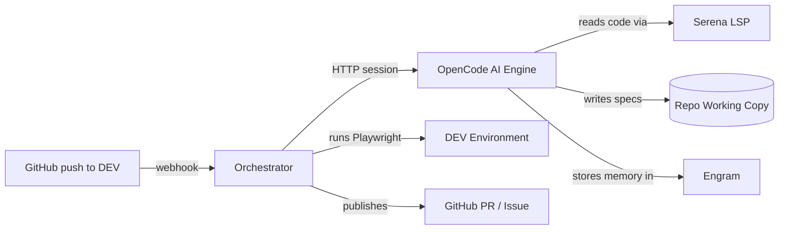

# ai-pipeline

<div align="center">

[](https://nodejs.org)
[](https://www.typescriptlang.org)
[](https://playwright.dev)
[](https://www.docker.com)
[](https://opencode.ai)

</div>

**Autonomous E2E QA that watches your repos and tests every deploy against DEV.**

When a commit lands on DEV, an AI agent reads the change, writes Playwright tests for what could break, runs them against the live environment, and either opens a PR against the app's repository with the new tests or files a GitHub Issue if something fails.

It is app-agnostic: onboard any repo by adding a single YAML file. No app code lives here.

---

## 1. Overview

ai-pipeline turns every deploy into a QA checkpoint, automatically.

| Capability | What it means |
|---|---|
| **Commit-aware testing** | Reads the diff and commit message to understand what changed. Skips style-only commits, writes targeted tests for features and fixes, runs regression-only for refactors. |
| **Two-model review** | A different AI model reviews every generated test for value. Tests that click without asserting, use fragile selectors, or miss the actual change are rejected before they reach the suite. |
| **Self-improving suite** | When tests pass and the reviewer approves, they are committed to the app's repository via PR with auto-merge. The suite grows with every deploy and never degrades into "green noise." |
| **Multi-app, single engine** | One centralized service watches all your team's repos. Each app gets its own namespace for test data and persistent memory. |
| **Shadow mode** | Onboard a repo without touching it: the full pipeline runs, but PRs and Issues are only logged. Flip the switch when you are ready. |

<details>
<summary>What it is not</summary>

- It does **not** build or start your app. Tests run against the live DEV URL.
- It does **not** replace your existing test suite. It augments it with AI-generated E2E coverage.
- It does **not** require per-app code changes. Onboarding is a YAML config file.

</details>

---

## 2. How it works

### Architecture



<table>
<tr>
<td width="50%" valign="top">

### Orchestrator
**Node.js** deterministic infrastructure.

Receives webhooks, manages the sequential queue, clones repos, runs Playwright against DEV, publishes results. Every side-effecting step is dependency-injected and unit-tested with stubs.

</td>
<td width="50%" valign="top">

### OpenCode
**AI engine** running two models.

The `qa-generator` agent reads code via Serena (semantic LSP navigation) and writes Playwright specs. The `qa-reviewer` subagent independently judges quality. Engram provides persistent episodic memory across runs.

</td>
</tr>
</table>

Both services share a volume for repo working copies. The AI agent reads code and writes tests directly where the orchestrator expects them.

### The QA pipeline

Every run follows the same sequence, whether triggered by a webhook or manually:

| Step | What happens |
|---|---|
| **1. Deploy gate** | Waits until DEV reports the right commit SHA and is healthy. Skipped if no health endpoint is configured. |
| **2. Classification** | Reads the commit message and diff. Conventional Commits like `style:` with no logic changes are skipped before spending a single token. |
| **3. Generation** | The AI agent reads the blast radius of the change using semantic code navigation, writes Playwright specs into the repo's `e2e/` folder, and invokes the reviewer. |
| **4. Static gate** | TypeScript compilation, ESLint, and Playwright's test list must pass. Invalid code is rejected before execution. |
| **5. Execution** | Playwright runs the specs against the live DEV URL with namespaced test data. Results are classified as pass, fail, or flaky. |
| **6. Decision** | Green and approved: PR with auto-merge. Failures: GitHub Issue. Flaky: quarantined. DEV down: infrastructure error. |

> [!NOTE]
> **Shadow mode** (`qa.shadow: true` in the app config) runs the full pipeline but does not publish PRs or open Issues. Use this when onboarding a repo for the first time.

### What happens at the end

| Outcome | Action |
|---|---|
| All green, reviewer approved | PR with auto-merge commits tests into the app's repository |
| All green, reviewer rejected | GitHub Issue for the team to iterate |
| Failures detected | GitHub Issue with sanitized logs |
| Flaky tests | Quarantined, no Issue created |
| DEV unhealthy | Marked as infrastructure error, not a code bug |

<details>
<summary>Execution modes</summary>

| Mode | When to use |
|---|---|
| `diff` (default) | Webhook-triggered: tests the blast radius of a single commit |
| `complete` | Fill coverage gaps: analyzes the whole repo and tests uncovered flows |
| `exhaustive` | Full audit: re-evaluates every existing test and regenerates the suite |
| `manual` | Focused: generation guided by a natural language prompt |

</details>

<details>
<summary>Quality gates</summary>

Three layers prevent low-quality tests from entering the suite:

| Layer | What it catches |
|---|---|
| **Static analysis** | Tests that do not compile, violate lint rules, or have missing metadata |
| **AI reviewer** | Tests with trivial assertions, fragile selectors, or no real verification of the change |
| **Flakiness detection** | Tests that pass only after retries are quarantined instead of accepted |

</details>

---

## 3. Getting started

### Prerequisites

- **Node.js 22** or later
- **Docker** and Docker Compose (for production deployment)
- An **OpenCode API key** (a single key covers both AI models)
- A GitHub repo you want to watch, deployed to a DEV environment

### Install and verify

```bash
git clone <this-repo>
cd ai-pipeline
npm install
npm test           # unit tests (network and AI calls are stubbed)
npm run typecheck  # strict TypeScript validation
```

### Configure your API key

```bash
cp .env.example .env
```

Edit `.env` and set:

```
OPENCODE_API_KEY=opencode-go-your-key-here
```

> [!IMPORTANT]
> The API key is the only mandatory secret for local development. For production, you also need `GITHUB_TOKEN` and `WEBHOOK_SECRET`.

### AI model configuration

The project uses two AI models via a single OpenCode API key. Both are pre-configured in `opencode/opencode.json` and require no changes to start.

| Agent | Model ID | Role |
|---|---|---|
| `qa-generator` | `opencode-go/deepseek-v4-pro` | Reads code, writes Playwright tests, invokes the reviewer |
| `qa-reviewer` | `opencode-go/qwen3.7-max` | Read-only quality judge; rejects tests with trivial assertions or fragile patterns |

> [!TIP]
> Run `opencode models` to verify both model IDs are available under your subscription. If a model is not listed, edit `opencode/opencode.json` and replace it with one that is. The reviewer must use a different model from the generator.

**What you must configure manually:**

| Item | Where | Required |
|---|---|---|
| API key | `.env` as `OPENCODE_API_KEY` | Yes |
| Model IDs | `opencode/opencode.json` under `agent.*.model` | Only if the defaults are unavailable |
| GitHub token | `.env` as `GITHUB_TOKEN` | Yes, for PR and Issue creation |
| Webhook secret | `.env` as `WEBHOOK_SECRET` | Yes, for production webhook validation |

<details>
<summary>What is pre-configured automatically</summary>

| Item | Where | Notes |
|---|---|---|
| Agent prompts and procedures | `opencode/agent/*.md` | Ready to use |
| Playwright authoring skills | `opencode/skill/playwright-authoring/` | Login, geolocation, mobile, uploads |
| Quality review criteria | `opencode/skill/test-value-review/` | False-positive pattern catalog |
| MCP servers (Serena, Engram) | `opencode/opencode.json` | Code navigation + persistent memory |
| Docker images | `Dockerfile`, `opencode/Dockerfile` | Both services build from these |

</details>

### Onboard an app

Copy the example config and fill in your app's details:

```bash
cp config/apps/example.yaml config/apps/my-app.yaml
```

Edit `config/apps/my-app.yaml`:

```yaml
name: "my-app"
repo: "your-org/your-repo"
baseBranch: "main"

dev:
  baseUrl: "https://dev.my-app.internal"

qa:
  needsReview: true
  shadow: true            # start in shadow mode: no PRs or Issues opened
  testDataPrefix: "qa-bot"

report:
  onFailure: "github-issue"
```

### Trigger a manual run

```bash
npm run qa -- --app my-app --sha <commit-sha>
```

<details>
<summary>Run in different modes</summary>

```bash
# Fill coverage gaps across the whole repo
npm run qa -- --app my-app --sha <commit-sha> --mode complete

# Audit and regenerate the entire suite
npm run qa -- --app my-app --sha <commit-sha> --mode exhaustive

# Focus on a specific feature
npm run qa -- --app my-app --sha <commit-sha> --mode manual --guidance "test the checkout flow with an empty cart"
```

</details>

### Deploy with Docker

```bash
# With Doppler for secrets
doppler run -- docker compose up --build

# Without Doppler (secrets in .env)
docker compose up --build
```

<details>
<summary>Trigger a run via webhook</summary>

```bash
SHA=$(git ls-remote https://github.com/your-org/your-repo main | cut -f1)
curl -X POST localhost:8080 \
  -H 'content-type: application/json' \
  -d "{\"repo\":\"your-org/your-repo\",\"sha\":\"$SHA\"}"
```

</details>

---

**Need more detail?** Read [`CLAUDE.md`](CLAUDE.md) for the full operational reference, [`AGENTS.md`](AGENTS.md) for OpenCode agent instructions.
